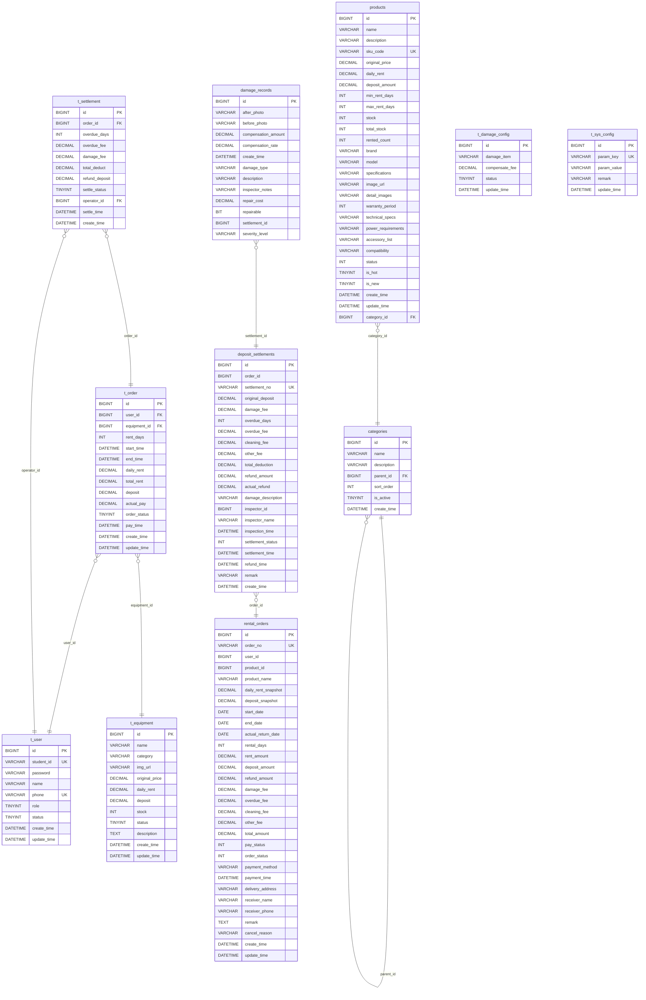

# 数据库ER图

使用Mermaid语法绘制的数据库实体关系图：

## 如何查看此ER图

1. **使用VSCode**：安装Mermaid插件后，打开此文件即可看到可视化的ER图。
2. **使用GitHub**：将此文件上传到GitHub仓库，GitHub会自动渲染Mermaid图表。
3. **使用Mermaid在线编辑器**：访问 https://mermaid.live/，复制粘贴上述代码即可查看。

## 关系说明

- **用户表(t_user)** 与 **订单表(t_order)**：一对多关系，一个用户可以创建多个订单
- **设备表(t_equipment)** 与 **订单表(t_order)**：一对多关系，一个设备可以被多个订单租赁
- **订单表(t_order)** 与 **结算记录表(t_settlement)**：一对多关系，一个订单对应一个结算记录
- **用户表(t_user)** 与 **结算记录表(t_settlement)**：一对多关系，一个管理员可以处理多个结算
- **分类表(categories)** 与 **分类表(categories)**：自关联，支持多级分类
- **分类表(categories)** 与 **商品表(products)**：一对多关系，一个分类可以包含多个商品
- **租赁订单表(rental_orders)** 与 **押金结算表(deposit_settlements)**：一对多关系，一个租赁订单对应一个押金结算
- **押金结算表(deposit_settlements)** 与 **损坏记录表(damage_records)**：一对多关系，一个押金结算可以包含多个损坏记录
